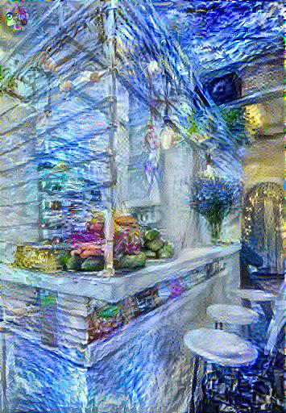

# Machine learning
Repositorio de pruebas de machine learning.

Contiene:  
- IA Notebooks: Notebooks de dotcsv.
	- Ataques adversarios.
	- Pruebas redes neuronales.
	- NN desde 0.
	- Pruebas.
	- Pix2Pix.
- Neural network example: Red neuronal de L capas, inspirada en cursos ofrecidos por Deeplearning.ai
	- L - 1 capas con activación RELU.
	- Capa L "Sigmoide" o "RELU".
	- Función de coste "Cross entropy", "Root mean squared error", "Mean squared error".
- Style transfer:
	- Neural Style Transfer by Gatys et al. (2015).
	  Content             | Style             | Generated
	  :-------------------------:|:-------------------------:|:-------------------------:
	    |  |  